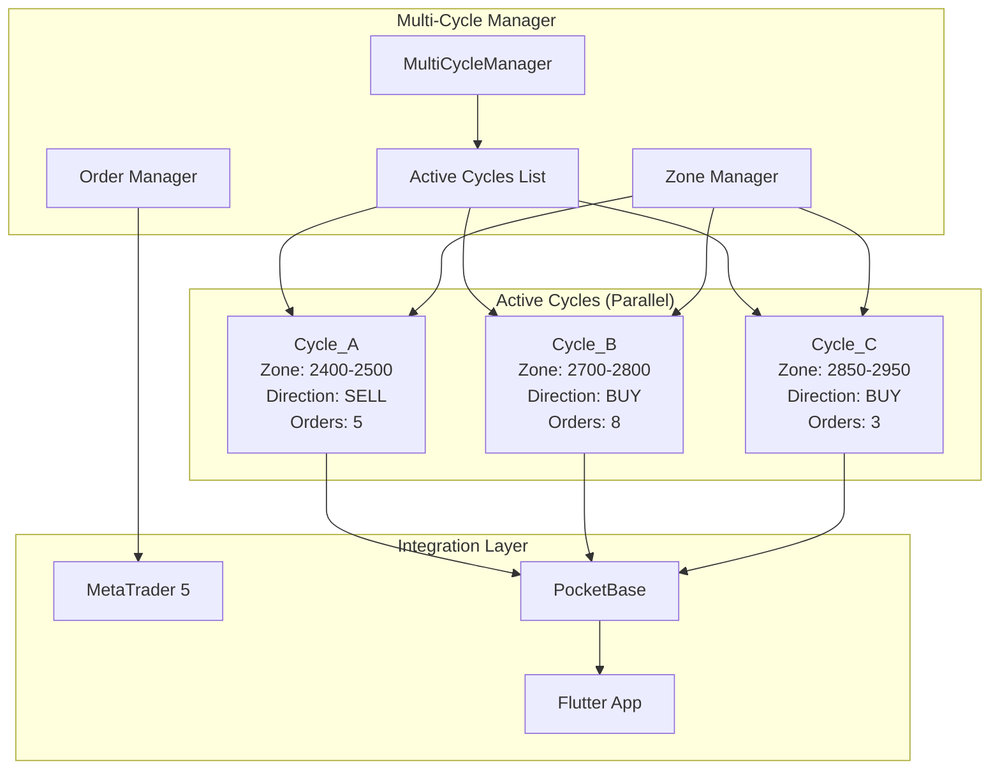

# System Patterns - Architecture & Design Decisions

## Overall Architecture: Dual-Platform Trading Ecosystem

### High-Level System Design
```
┌─────────────────────┐    ┌─────────────────────┐
│   Python Desktop    │    │  Flutter Mobile/Web │
│   (Primary Trading) │    │   (Monitoring)      │
├─────────────────────┤    ├─────────────────────┤
│ • Flet UI           │    │ • Flutter/Dart      │
│ • Strategy Engine   │    │ • Riverpod State    │
│ • MT5 Integration   │    │ • Material Design   │
│ • Local SQLite      │    │ • Cross-Platform    │
└─────────┬───────────┘    └─────────┬───────────┘
          │                          │
          └──────────┬─────────────────┘
                     │
         ┌───────────▼────────────┐
         │   PocketBase Cloud     │
         │   (Unified Backend)    │
         ├────────────────────────┤
         │ • Real-time Sync       │
         │ • User Authentication  │
         │ • Trading Data         │
         │ • Event Logging        │
         │ • MCP Server           │
         └────────────────────────┘
```

## Component Architecture Patterns

### 1. Strategy Component System (Python Desktop)
**Pattern**: Modular Strategy Components with Dependency Injection

```python
# Base Strategy Pattern
class Strategy(ABC):
    @abstractmethod
    def initialize(self) -> bool
    @abstractmethod
    async def handle_event(self, event) -> bool

# Component-Based Strategy
class AdvancedCyclesTrader(Strategy):
    def __init__(self):
        self.zone_engine = ZoneDetectionEngine()
        self.order_manager = AdvancedOrderManager()
        self.direction_controller = DirectionController()
```

**Benefits**:
- Testable components (100% test coverage achieved)
- Modular design for easy extension
- Clear separation of concerns
- Dependency injection for flexibility

### 2. Database Layer Pattern
**Pattern**: Repository Pattern with Multi-Database Support

```
Database Architecture:
├── Local SQLite (Python Desktop)
│   ├── Strategy-specific tables
│   ├── Local cache for performance
│   └── Migration support
└── PocketBase Cloud (Shared)
    ├── User accounts & authentication
    ├── Trading data synchronization
    ├── Real-time event streaming
    └── Cross-platform data sharing
```

**Key Patterns**:
- Repository pattern for data access abstraction
- Migration system for schema evolution
- Dual-database strategy for performance + sync

### 3. Real-Time Communication Pattern
**Pattern**: Event-Driven Architecture with Cloud Sync

```
Event Flow:
Python Desktop ──► Local Processing ──► PocketBase Cloud
                                      │
Flutter App    ◄── Real-time Sync ◄──┘
```

**Implementation**:
- Local-first processing for speed
- Cloud synchronization for consistency
- Event streaming for real-time updates

## Advanced Trading Strategy Patterns

### 1. Zone-Based Trading Algorithm
**Pattern**: State Machine with Component Coordination

```
Zone Trading State Flow:
Entry Price Set → Threshold Monitoring → Zone Activation → 
Continuous Orders → Direction Switch → Batch Management
```

**Components**:
- `ZoneDetectionEngine`: Threshold monitoring and zone management
- `AdvancedOrderManager`: Continuous order placement (50-pip intervals)
- `DirectionController`: Direction determination and switching logic
- `LossAccumulator`: Cross-cycle loss tracking

### 2. Order Management Pattern
**Pattern**: Batch Processing with Risk Management

```
Order Management:
├── Continuous Placement (every candle)
├── 50-pip Interval Management
├── Batch Stop-Loss (300 pips from last order)
└── Direction-based Batch Switching
```

### 3. Loss Tracking Pattern
**Pattern**: Hybrid Loss Management System

```
Loss Management:
├── Global Loss Tracker (cross-cycle persistence)
├── Cycle-Specific Records (immediate tracking)
└── Take-Profit Adjustment (loss compensation)
```

## UI Architecture Patterns

### 1. Python Desktop (Flet) Patterns
**Pattern**: Page-Based Navigation with Global State

```python
# FletX Navigation Pattern
Xapp(
    page=page,
    routes=[
        route(route=AppRoutes.HOME, view=HomePageView),
        route(route=AppRoutes.ACCOUNTS, view=AccountPageView),
        route(route=AppRoutes.BOTS, view=BotsPageView),
    ]
)
```

### 2. Flutter App Patterns
**Pattern**: Feature-Based Package Architecture

```
Packages Structure:
├── Core Packages (shared functionality)
│   ├── app_logger/
│   ├── app_theme/
│   ├── auth/
│   └── globals/
├── Feature Packages (specific features)
│   ├── events_service/
│   ├── notifications/
│   └── useful_widgets/
└── Strategy Packages (trading algorithms)
    ├── cycles_trader/
    ├── adaptive_hedge/
    └── stocks_trader/
```

**Benefits**:
- Modular development with clear boundaries
- Reusable components across features
- Independent testing and deployment
- Clear dependency management

## Development Workflow Patterns

### 1. Memory Bank System Pattern
**Pattern**: Hierarchical Rule-Based Workflow

```
Workflow Modes:
VAN (Initialize) → PLAN (Strategy) → CREATIVE (Design) → 
IMPLEMENT (Build) → REFLECT (Review) → ARCHIVE (Document)
```

### 2. AI-Assisted Development Pattern
**Pattern**: MCP Integration for Enhanced Development

```
MCP Server Integration:
├── PocketBase Data Access
├── Real-time Database Queries
├── Trading Strategy Monitoring
└── Development Assistance
```

## Quality Assurance Patterns

### 1. Testing Strategy
**Pattern**: Comprehensive Multi-Layer Testing

```
Testing Layers:
├── Unit Tests (component-level)
├── Integration Tests (system-level)
├── Strategy Tests (algorithm validation)
└── End-to-End Tests (full workflow)
```

**Achievement**: 100% test coverage for Advanced Cycles Trader

### 2. Error Handling Pattern
**Pattern**: Layered Error Handling with Logging

```python
# Comprehensive Error Handling
try:
    result = await trading_operation()
except TradingError as e:
    logger.error(f"Trading error: {e}")
    await handle_trading_error(e)
except Exception as e:
    logger.error(f"Unexpected error: {e}")
    await handle_system_error(e)
```

## Key Design Principles

1. **Separation of Concerns**: Clear boundaries between components
2. **Testability**: All components designed for comprehensive testing
3. **Modularity**: Easy to extend and modify individual components
4. **Performance**: Local-first processing with cloud synchronization
5. **Reliability**: Comprehensive error handling and recovery
6. **Scalability**: Architecture supports multiple strategies and accounts
7. **Maintainability**: Clear code structure with comprehensive documentation

This architecture ensures professional-grade trading capabilities with the flexibility to evolve and scale as requirements grow.

# System Patterns - Advanced Trading Platform

## 🏗️ CURRENT ARCHITECTURE UPDATE: Multi-Cycle Management System

### **CRITICAL ARCHITECTURAL CHANGE**: Advanced Cycles Trader Multi-Cycle Management

**Problem**: Current single-cycle architecture creates new cycle every candle and closes previous ones
**Solution**: Multi-cycle management system that maintains multiple active cycles simultaneously

### **New Architecture Pattern: Parallel Cycle Management**



### **Design Patterns Applied**

#### **1. Strategy Pattern - Multi-Cycle Coordination**
```python
class MultiCycleStrategy:
    """Coordinates multiple trading cycles simultaneously"""
    def __init__(self):
        self.active_cycles = []      # List of active cycles
        self.cycle_strategies = {}   # Strategy per cycle
        self.zone_manager = ZoneManager()
        
    def execute_strategy(self, market_data):
        """Execute strategy across all active cycles"""
        for cycle in self.active_cycles:
            cycle.execute_orders(market_data)
            cycle.monitor_zones(market_data)
            cycle.check_reversal_conditions(market_data)
```

#### **2. Observer Pattern - Real-Time Updates**
```python
class CycleObserver:
    """Observes cycle events and updates database/UI"""
    def on_cycle_created(self, cycle):
        self.update_database(cycle)
        self.notify_flutter_app(cycle)
    
    def on_order_placed(self, cycle, order):
        self.update_cycle_orders(cycle, order)
        self.sync_with_pocketbase(cycle)
    
    def on_cycle_closed(self, cycle, reason):
        self.finalize_cycle(cycle, reason)
        self.update_statistics(cycle)
```

#### **3. Factory Pattern - Cycle Creation**
```python
class CycleFactory:
    """Creates cycles based on zone breach conditions"""
    def create_zone_cycle(self, zone_data, direction, entry_price):
        """Create new cycle for zone-based trading"""
        cycle_data = {
            "id": self.generate_cycle_id(),
            "zone_base": zone_data["base_price"],
            "direction": direction,
            "entry_price": entry_price,
            "zone_threshold": zone_data["threshold"],
            "order_interval": 50,  # 50 pip intervals
            "reversal_distance": 300  # 300 pip reversal trigger
        }
        return AdvancedCycle(cycle_data, self.meta_trader, self.bot)
```

#### **4. Repository Pattern - Database Operations**
```python
class MultiCycleRepository:
    """Manages database operations for multiple cycles"""
    def save_all_cycles(self, cycles):
        """Save all active cycles to database"""
        for cycle in cycles:
            self.save_cycle(cycle)
    
    def sync_cycle_orders(self, cycle):
        """Synchronize cycle orders with MetaTrader"""
        live_orders = self.get_live_orders(cycle.id)
        cycle.update_orders(live_orders)
        self.update_database(cycle)
```

### **Zone-Based Trading Logic Pattern**

#### **Zone Detection and Management**
```python
class ZoneManager:
    """Manages multiple trading zones simultaneously"""
    def __init__(self):
        self.active_zones = {}
        self.zone_thresholds = {
            "batch_stop_loss": 100,    # 100 pips
            "zone_activation": 300,    # 300 pips  
            "reversal_trigger": 300    # 300 pips from highest
        }
    
    def detect_zone_breach(self, price, entry_price):
        """Detect when price breaches zone thresholds"""
        pip_distance = abs(price - entry_price) * self.get_pip_value()
        
        if pip_distance >= self.zone_thresholds["zone_activation"]:
            return self.create_new_zone(price, "opposite_direction")
        
        return None
    
    def check_reversal_conditions(self, cycle, current_price):
        """Check if cycle should reverse direction"""
        if cycle.direction == "BUY":
            highest_price = max(order["price"] for order in cycle.orders)
            reversal_price = highest_price - (300 / self.get_pip_value())
            
            if current_price <= reversal_price:
                return self.trigger_reversal(cycle, "SELL")
        
        elif cycle.direction == "SELL":
            lowest_price = min(order["price"] for order in cycle.orders)
            reversal_price = lowest_price + (300 / self.get_pip_value())
            
            if current_price >= reversal_price:
                return self.trigger_reversal(cycle, "BUY")
        
        return None
```

### **Order Management Pattern**

#### **Continuous Order Placement**
```python
class ContinuousOrderManager:
    """Manages continuous order placement across multiple cycles"""
    def __init__(self, meta_trader):
        self.meta_trader = meta_trader
        self.order_queue = []
        self.retry_handler = RetryHandler()
    
    def place_cycle_orders(self, cycle, current_price):
        """Place orders for a specific cycle"""
        if self.should_place_order(cycle, current_price):
            order_price = self.calculate_next_order_price(cycle, current_price)
            
            order_request = {
                "symbol": cycle.symbol,
                "direction": cycle.direction,
                "price": order_price,
                "volume": cycle.lot_size,
                "sl": 0,  # No individual stop loss
                "tp": 0,  # No individual take profit
                "cycle_id": cycle.id
            }
            
            return self.execute_order_with_retry(order_request)
    
    def calculate_next_order_price(self, cycle, current_price):
        """Calculate next order price at 50-pip intervals"""
        order_count = len(cycle.active_orders) + 1
        pip_value = self.get_pip_value(cycle.symbol)
        interval_pips = 50.0
        
        if cycle.direction == "BUY":
            return current_price + (interval_pips * order_count / pip_value)
        else:  # SELL
            return current_price - (interval_pips * order_count / pip_value)
```

### **Database Integration Pattern**

#### **Multi-Cycle Database Synchronization**
```python
class MultiCycleDatabaseSync:
    """Synchronizes multiple cycles with PocketBase database"""
    def __init__(self, api_client):
        self.api_client = api_client
        self.sync_queue = []
        
    def sync_all_cycles(self, active_cycles):
        """Synchronize all active cycles with database"""
        for cycle in active_cycles:
            try:
                self.sync_cycle_to_database(cycle)
                self.sync_cycle_orders(cycle)
            except Exception as e:
                logger.error(f"Failed to sync cycle {cycle.id}: {e}")
                self.add_to_retry_queue(cycle)
    
    def handle_cycle_events(self, event_type, cycle, data=None):
        """Handle cycle lifecycle events"""
        if event_type == "cycle_created":
            self.create_cycle_in_database(cycle)
        elif event_type == "order_added":
            self.add_order_to_cycle(cycle, data)
        elif event_type == "cycle_closed":
            self.close_cycle_in_database(cycle, data.get("reason"))
```

## 🔧 COMPONENT INTEGRATION PATTERNS

### **MetaTrader 5 Integration**
- **Pattern**: Adapter Pattern for MT5 API abstraction
- **Retry Logic**: Exponential backoff for order placement failures
- **Error Handling**: Comprehensive diagnostics and recovery mechanisms
- **Performance**: Sub-second order execution requirements

### **PocketBase Cloud Integration**
- **Pattern**: Repository Pattern for database operations
- **Real-time Sync**: WebSocket connections for live updates
- **Data Consistency**: Atomic transactions for multi-cycle operations
- **Flutter Integration**: Real-time data streaming to mobile/web app

### **Flutter Frontend Integration**
- **Pattern**: Provider/Riverpod for state management
- **Real-time Updates**: Stream-based UI updates
- **Multi-cycle Display**: Tabbed interface for cycle management
- **User Actions**: Close cycle buttons and bulk operations

## 📊 PERFORMANCE OPTIMIZATION PATTERNS

### **Memory Management**
```python
class CycleMemoryManager:
    """Manages memory usage for multiple active cycles"""
    def __init__(self, max_cycles=10):
        self.max_cycles = max_cycles
        self.cycle_cache = {}
        
    def add_cycle(self, cycle):
        """Add cycle with memory management"""
        if len(self.cycle_cache) >= self.max_cycles:
            self.cleanup_oldest_closed_cycle()
        
        self.cycle_cache[cycle.id] = cycle
    
    def cleanup_oldest_closed_cycle(self):
        """Remove oldest closed cycle to free memory"""
        closed_cycles = [c for c in self.cycle_cache.values() if c.is_closed]
        if closed_cycles:
            oldest = min(closed_cycles, key=lambda c: c.close_time)
            del self.cycle_cache[oldest.id]
```

### **Database Query Optimization**
```python
class OptimizedCycleQueries:
    """Optimized database queries for multi-cycle operations"""
    def get_active_cycles_batch(self, bot_id):
        """Get all active cycles in single query"""
        return self.api_client.collection("cycles").get_list(
            filter=f"bot='{bot_id}' && status='active'",
            expand="orders",
            sort="-created"
        )
    
    def bulk_update_cycles(self, cycle_updates):
        """Bulk update multiple cycles efficiently"""
        # Implementation for batch updates
        pass
```

## 🛡️ ERROR HANDLING PATTERNS

### **Resilient Order Placement**
```python
class ResilientOrderPlacement:
    """Handles order placement failures gracefully"""
    def __init__(self):
        self.retry_attempts = 3
        self.backoff_multiplier = 2
        
    def place_order_with_resilience(self, order_request):
        """Place order with comprehensive error handling"""
        for attempt in range(self.retry_attempts):
            try:
                result = self.meta_trader.order_send(order_request)
                if result and hasattr(result, 'retcode') and result.retcode == 10009:
                    return result.order
                else:
                    self.diagnose_failure(result)
                    
            except Exception as e:
                logger.error(f"Order placement attempt {attempt + 1} failed: {e}")
                if attempt < self.retry_attempts - 1:
                    time.sleep(self.backoff_multiplier ** attempt)
        
        return None
```

## 📈 MONITORING AND OBSERVABILITY

### **Cycle Performance Monitoring**
```python
class CyclePerformanceMonitor:
    """Monitors performance across multiple cycles"""
    def __init__(self):
        self.metrics = {
            "cycles_created": 0,
            "orders_placed": 0,
            "order_failures": 0,
            "database_sync_errors": 0,
            "average_response_time": 0.0
        }
    
    def track_cycle_creation(self, cycle):
        """Track cycle creation metrics"""
        self.metrics["cycles_created"] += 1
        logger.info(f"Cycle created: {cycle.id} (Total: {self.metrics['cycles_created']})")
    
    def track_order_placement(self, success, response_time):
        """Track order placement performance"""
        if success:
            self.metrics["orders_placed"] += 1
        else:
            self.metrics["order_failures"] += 1
        
        self.update_average_response_time(response_time)
```

---

## 🔄 PREVIOUS SYSTEM PATTERNS (MAINTAINED)

### Core Platform Architecture
- **Dual-Platform Design**: Python desktop + Flutter mobile/web
- **Cloud-First Database**: PocketBase for real-time synchronization
- **Component-Based Trading**: Modular strategy components
- **Memory Bank System**: Persistent project knowledge management

### Trading Strategy Framework
- **Strategy Base Class**: Common interface for all trading strategies
- **MetaTrader Integration**: Unified MT5 API abstraction
- **Database Repositories**: Clean separation of data access
- **Event-Driven Architecture**: Async event handling for trading events

### Development Workflow
- **Hierarchical Rules**: Token-optimized development workflow
- **Visual Process Maps**: Clear development guidance
- **MCP Integration**: AI-assisted development tools
- **Comprehensive Testing**: Multi-layer validation strategy
